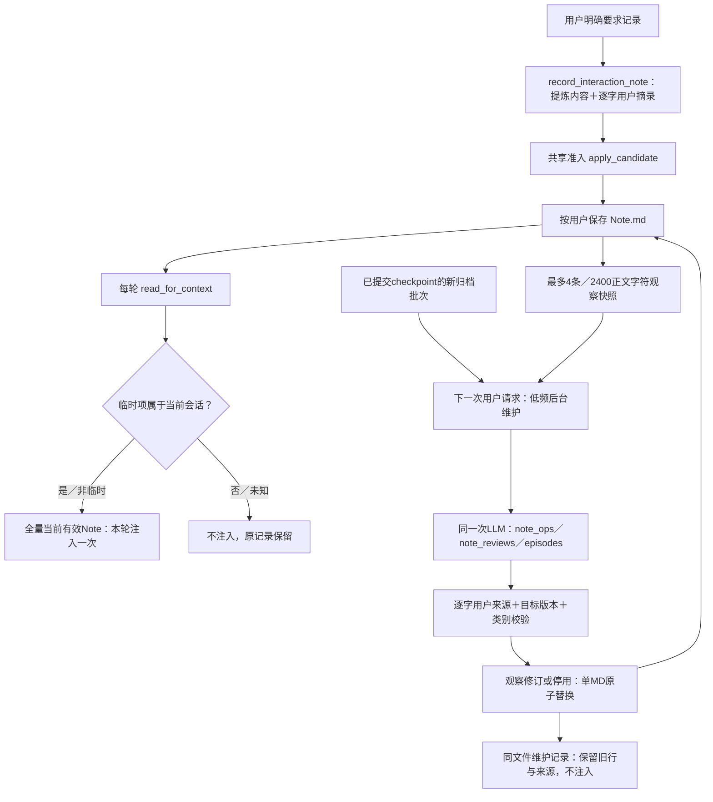

# Note 生命周期与低频观察维护

更新：2026-10-03。实现：`interaction_note.py`、`archive_maintenance.py`、`RecordInteractionNoteTool`。本包沿用Markdown，不新增Note JSON库、工具或单独Curator模型。

## 1. 产品边界

Note保存剧情外的当前交互约定，不是阅读手账、故事事实库或按日互动经历。已确认偏好／约束仍每轮完整注入；开放观察只作待验证弱提示。

临时项首版采用容易验证的默认：**只属于写入会话**。换会话不注入，回到原会话仍有效；不因重启消失，也不删除原记录。它不是截止日期、提醒或cron任务，不解析“今天／明天”，不绑定阅读位置。若要长期约定，应显式保存为偏好／约束。没有可信来源会话的手写临时行不注入，原Markdown保留。

此规则是当前实现的简化取舍，不是所有临时需求都适用；用户核验后再考虑显式绝对截止时间／阅读位置条件，不从模糊自然语言猜一个过期时间。

## 2. 读写与维护

### 热读

`read_for_context(owner, session_key)`返回全部当前有效内容，移除其他会话／来源未知的临时行与维护区，不按语义TopK裁剪。自定义Markdown在非临时区保留。`read(owner)`读取当前活动区域，仍可看到原临时行；文件本身还保留维护历史。owner仍由服务端确定。

新Note运行块设置 `replay=False`：本轮有效，原始JSONL仍保存，后续模型回放不重复带旧快照；原生Loop失效包含这些旧块的provider私有续接状态，工具循环内部仍可续接。已有旧版 `replay=True`／未分块的历史**没有批量改写**，可能仍回放旧Note；当前提示要求本轮Note优先，严格兼容迁移尚待做。建议核验新行为时新建会话，不声称旧摘要、用户原话或模型旧回复会被“遗忘”。改变私有状态复用可能影响长聊成本，真实延迟／缓存尚未测。

### 低频观察复核

复用已绑定会话的归档协调器，只有新已提交批次时调维护模型；不每轮复核、不新增模型链、不绑Dream。输入同一owner活动观察，最多4条、正文共2400字符，整条取舍；其余观察本轮不复核，不宣称全量覆盖或公平轮转。三个输出数组各最多4条；旧响应缺 `note_reviews` 时兼容为空。

`note_reviews`模型输入参数：`note_id, action=revise|retire, content, message_index, source_quote`。目标只能来自本次开放观察快照，来源只能逐字出自本批用户文本；不得引用助手、工具或旧Note当新用户证据。`revise`保留原ID、强制“待验证：”，`retire`不加新内容；不支持confirm／提升类别。提示词要求明确否定才停用、同主题直接新线索才修订，没有新证据不因沉默整理。

来源子串校验只证明引用存在，**不证明语义支持或观察推断正确**。目前没有新真实模型复核结果，不能宣称写入精确率。模型一次误判仍可能建议错误停用；原行留在维护区可查，未来再评是否需要候选确认。

### 保存与失败

Note操作与经历候选先各自验证，再保存Note／观察变更，最后写经历与联合水位；不是跨文件事务。复核以原行revision核对最新文件，目标被前台删除／改动就放弃结果，不恢复旧条目；其他新追加Note保留。同一次复核用稳定操作ID去重，单个Note文件原子替换，IO失败保留活动正文，归档失败不推进处理水位。

`## 维护记录（不注入）`与活动区在同一MD，保存旧行、处理时间、用户原话摘录和匿名来源会话／回合。它是可审计记录，不是另一套检索记忆，也不把模型旧观察再注入。显式forget是移除活动条目，不等于删除所有旧会话或维护审计；完整个人数据删除另有TODO。

`STORYPAL_AUTO_NOTE=0`关闭新增Note和复核；不影响无模型的当前会话临时项过滤。自动路径仍拒绝新增无可靠失效范围的临时项，显式路径才写会话范围临时项。Dream规则禁止提升临时／已停用／未确认观察；**本包未把Dream接成当前owner的Note消费流程**，也没修改真实SOUL／USER。

## 3. 测试与用户核验

受影响回归最终86/86，10.40s，覆盖新生命周期、既有Note／归档／历史回放／Skill／人格／query导出；末轮补观察被移至稳定分类、重复ID及无关新增约定保护。初组43、83、84项包含在最终组中，不累加。全部合成材料＋替身provider，没有新真实模型或小说数据发送；不同回归进程耗时不是产品提速数据。

原生Loop两轮测试确认：第一轮旧观察保存于JSONL；停用后第二轮输入没有旧Note或维护正文，用户原话仍在，provider旧私有状态被弃用。程序测试不证明模型会自然挑选temporary类别或正确判断观察语义。

用户方便时可核验：在新会话明确说“请记住，这个会话先简短回答”，确认保存后新开会话看是否不再沿用；正式偏好应仍可跨会话。不要为测试修改阅读进度。观察自动复核要等已归档批次，不能期待发一句纠正就立即出现后台维护；当轮纠正直接优先，明确删除可用forget工具同步执行。

## 4. TODO

- 少量授权真实模型样本：类别误选、同主题／语义支持、静默保留与错误停用。
- 截止日期／阅读位置失效条件、旧历史运行块兼容迁移、维护历史查看／恢复UI。
- 更长Note的整体整理、观察公平轮转、Dream的按用户消费及完整删除语义。
- 下一个功能包：手账编辑／删除及进度变化后的旧预测回看，不由Note代替。
