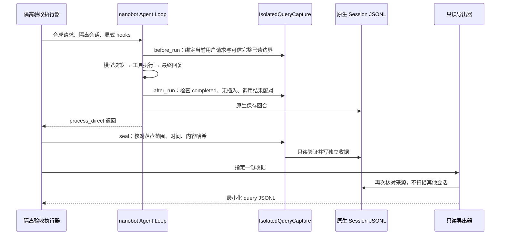

# 隔离 Agent 查询收据与只读导出

更新：2026-10-03。实现：`chatbot/src/storypal_chatbot/query_capture.py`。本接口不是普通聊天工具，不全局监听、不扫描真实用户历史；仅在明确选择的隔离验收回合中使用。

## 1. 为什么需要它

区分原始用户问题、人工 `gold_rewrite` 和真实模型提交给 `search_story` 的 query。不能用人工答案词改写冒充 Agent 效果，也不能因为没有找到日志就判定 Agent 选择了不检索。



## 2. 使用方式

Python 执行器创建 `IsolatedQueryCapture(case_id=..., session_key=..., origin="synthetic")`，传入 `process_direct(..., hooks=[capture])`。调用返回后，使用 `capture.seal(transcript=原生会话路径, output=新收据路径)`，不能把 Hook 结束等同于落盘成功。

只有另获发送授权、确实调用真实 provider 的执行器才声明 `origin="agent_trace", model=受支持模型名`。**来源标签是执行器的声明，不是加密证明模型真的调用过**；真实调用用量和来源材料仍须单独审阅。默认 synthetic，程序测试不会升级成真实样本。

在项目根目录，用 Conda 环境运行：

```powershell
python -m storypal_chatbot.query_capture --receipt .runtime/retrieval-experiments/isolated/<验收名>/receipt.json --output .runtime/retrieval-experiments/agent-queries/<验收名>.jsonl
```

安装后也可使用 `storypal-export-agent-query`。CLI 只读指定收据／JSONL，输出必须是上述 `agent-queries` 目录中的新文件，不覆盖已有导出。收据及原始隔离会话必须在 `isolated` 下；不是面向任意正式会话的通用导出命令。

## 3. 输出与判定

最小字段：`case_id, origin, trace_ref（匿名）, work_id, max_order, decision`。实际搜索再有 `tool_name="search_story", arguments={query}`；每例只取首个真实搜索调用。收据另含版本、模型、匿名会话引用、原生落盘消息区间、时间／内容哈希，导出不带这些内部字段或完整聊天。

- `max_order` 来自验证过的持久运行时状态，只取**完整已读单元**，不把正在读的部分单元当作完整边界；归档维护器原有保守部分范围行为不变。
- `search` 表示提交过合法搜索参数，不表示工具成功、证据足够或最终回答正确。
- `skip` 仅表示完整回合没有任何工具调用；走其他工具路线拒绝导出，不误记为不需要检索。
- 未结束、异常、取消、迭代耗尽、插入新输入、工具结果缺失／错配／重复、伪造运行时来源或回合内变更阅读状态，均拒绝。
- 后续回合追加不影响已封存区间；被压缩、有待处理用户输入、时间／参数／边界被改动则拒绝。首版不支持多模态、并发封存或跨压缩恢复。

哈希验证文本用户／助手消息和调用配对，**不含工具返回正文**；它不是工具事实、失败分类或剧情理解验真。分析工具内容仍需另一项经授权的隔离核验。路径限制与哈希也不是抵抗本机恶意用户的签名系统。

## 4. 已验证与尚缺什么

本轮受影响程序回归最终 67/67，5.96 秒，其中导出模块 23 项；先前同组5.61秒不累加。原生 Loop＋替身 provider 验证 Hook→保存→封存→导出，synthetic 标签不会被算法端当成真实 Agent query。这是程序接线验证，不是文学效果。末轮唯一警告是 pytest cache 目录无写权限，不影响临时夹具或断言。

真实故事 `agent_query` 仍为 **0**。同轮另获批的 3 次 Luna 调用用于合成经历抽取／`recall_interaction_history`，不是 `search_story`，不能填入这批检索金标。新增真实故事请求、材料范围和预算需单独获批；全部运行材料保持 Git 忽略，公开仓库只提交自有代码、测试与去敏结果。
