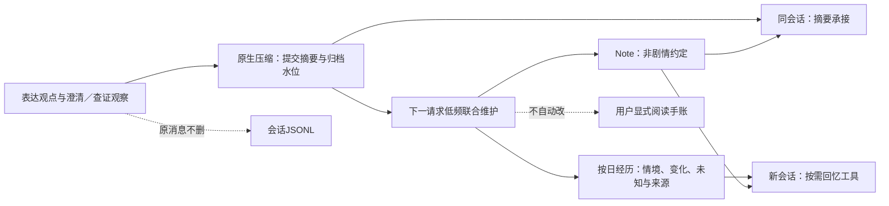

# 连续陪读与记忆联动测试规范

日期：2026-10-04。目标是验证读者的理解可以持续演进，而不是每轮只做单次检索。程序结果、真实模型小样、真人满意度分开。

## 1. 三个层次与材料边界

- 本地程序：`chatbot_tests/test_continuous_memory_workflow.py`。真实nanobot压缩、JSONL／Markdown、联合维护、上下文恢复、工具调用和LanceDB；LLM摘要／抽取／回复及向量是替身。21项，不读取正式会话、不加载本地模型、不联网。
- 真实模型：`chatbot_tests/manual_memory_acceptance.py`。用户已明确批准本批最多12次GPT-6 Luna＋3次GPT-6 Sol，独立账本、每步骤一次、失败占次数、禁重发。全部合成材料＋公开模板，不发送小说／真实用户信息，正式后台开关不动。Sol只模拟三条用户表达；Luna分别做摘要、抽取和主Agent。
- 真人体验：仍由用户在《流浪地球》真实已读范围判断首句抓点、承接与理解增量。程序预设答复或模拟评分不能代替真人认可。

程序里的人物和片段是合成夹具，不冒充《流浪地球》原文事实。真实小说的独立理解任务和必要原文集合由检索线维护；应用线首先验证这些不同需求怎样通过同一记忆链路传递。

## 2. 程序场景：5条完整链＋16条故障／时序／类别测试

每条完整链包含：带可信运行时状态的18条合成消息→真实压缩→重载→联合维护→同会话摘要承接→全新会话真实回忆工具→原手账／身份文件／进度不变。再验证较早边界、其他owner、其他作品不可读取该经历，空路径不编码。

| 场景 | 用户真正关心的点 | 输入观察 | 程序判据（不是唯一答案） |
| --- | --- | --- | --- |
| 人物立场 | 喜欢救人，但质疑转折铺垫 | 合成工具error | 用户澄清可溯源；失败不被标成取证成功 |
| 人物关系 | 没丢下对方，不等于已经和解 | empty | 旧观点与当前澄清都能交接；空结果不等于不存在 |
| 局部因果 | 时间先后不能直接证明原因 | unclassified | 未分类观察保留该状态，不冒充已核实 |
| 伏笔读法 | 可能回扣，不等于作者已证实 | evidence_returned | 返回原文只证明取证，不为文学解释盖章 |
| 情绪暂停 | 暂停分析，聊感受 | error | 暂停意图作为用户澄清进入传递链；实际是否停分析由真实模型另验 |

其余16项：摘要网络异常／截断／空输出／非法tool_calls（4）；维护JSON错误／截断／非法tool_calls／助手写Note／注入块伪引用／未来消息索引（6）；在途维护仍能前台聊天且Note下一轮生效（1）；无持续价值／双开关关闭／只Note／只经历（4）；1500字符可见前缀外引用拒绝（1）。

特别注意：原生摘要失败时可采用RAW兜底并提交水位；联合维护仍能读取保存的原消息。这不同于“联合抽取失败”：后者不推进自己的处理水位，重启后可重试。两层水位不可混为一个checkpoint。

## 3. 真实模型批次：固定6类目标

| 编号 | 实际路径 | Luna上限 | 首要检查 |
| --- | --- | ---: | --- |
| C1 | 原生压缩→联合抽取→空白会话选择回忆→观察后答复 | 4 | 澄清不变误读、失败不变核实、来源仍在、不自动改手账 |
| C2 | 原生压缩→同会话承接 | 2 | 区分动机与铺垫；不补造过去立场 |
| C3 | 当前资料足够，用户明确暂停分析 | 1 | 不查证、不长篇推理、不强行追问 |
| C4 | 已知s-12，请求核对原句；来源故意不可用 | 2 | 按ID取证、诚实说明未完成，不说原文没有 |
| C5 | 用户忘记旧预测，保存内容与新片段不一致 | 2 | 查询原手账、区分旧想法与当前材料，不擅改原观点 |
| C6 | 当前片段已有全部相关事实 | 1 | 直接区分救人和参与实验，不机械查工具 |

Sol分别为C1／C2／C5生成一条自然用户消息，各限1次。若生成失败，不换问法重试来挑好结果；若模型提前直接回答或工具未被调用，记录真实路径与失败，不强凑15次。若流程抛错，查看已持久日志，不能重新执行整个批次来重置预算。

回忆索引使用确定性向量，以隔离“模型是否选择记忆、抽取是否忠实”与Embedding排序效果。因此本批不报告语义召回准确率或阈值优化。真实检索模型对照另在算法线运行。

## 4. 记录与复核

记录每场景：实际模型、物理请求次数／完成类型、provider token与耗时、工具名和参数、原始资料是否仍在、摘要是否只保留当前观点、记忆源／范围、手账及进度是否变更。不要只报最终答复看起来不错。

程序通过与真实输出人工复核分别记录。文学理解可以有不同解读；硬错误包括补不存在的事实、误认观点归属、把失败当核实、越界或未授权写入。摘要／回复“澄清成此前误读”属于失真，即使最后建议合理也不能判全通过。

原始合成trace留忽略目录，公开仅必要统计和合成回复片段。结果入口：[result.md](../../result.md)，进度入口：[开发进度](CHATBOT_DEVELOPMENT_PROGRESS.md)。

本地回归请指定项目内**全新**临时目录，先确认不存在；pytest会管理它，不要复用有资料的目录。缺省pytest临时路径此前遇到权限错误。
