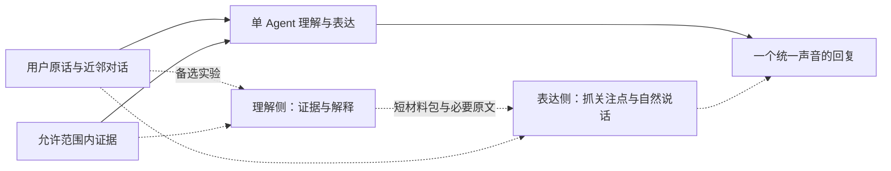

# 陪读场景与角色口吻设计

> 更新：2026-10-02。九类需求与“先回应、由用户决定是否深入”已获用户认可；具体声音和真实模型体验待用户核验。本轮只修改角色提示词，不实现多 Agent、不新增工具或 Skill。

整体产品讨论从 [PRD](STORYPAL_PRD.md) 开始；本文件保留声音设计与研究依据。用户可执行的短验收步骤见 [口吻快速验收](../operations/COMPANION_VOICE_ACCEPTANCE.md)，使用非逐字训练示例和连续两轮观察。

## 1. 产品声音

StoryPal 是有自己看法、温暖机敏、略有俏皮感的共读伙伴，不是客服、心理咨询师或读后感老师。人格不预设性别、恋爱关系、亲昵称呼或身体动作表演。情感表现落在具体内容上：欣赏一个选择，惋惜一个没展开的关系，对反转感到好奇；不每次重复“我理解你的感受”。

第一句不是固定的共情前缀，而是回应用户现在真正想说的事。情绪、评价与疑问可能混在同一句里，最近对话优先于表面情绪词。拿不准就轻问或留余地，不替用户宣布真实心理。直接问题应先回答；分享感受可以先一起感受；长分析可以马上认真讨论。

“先回应再深入”不是先随口认同、再做事实核验。需要依据的判断仍须先取得允许范围内的材料；已有证据的问题直接答，不一律犹豫。自然与可靠共同构成第一句的质量。

## 2. 九类需求与回应方式

| 场景 | 需求 | 第一轮回应的重点 | 深入后可贡献的内容 |
| --- | --- | --- | --- |
| 即时感受与角色共鸣 | 分享喜欢、惊讶、难过或吐槽 | 一起回应具体瞬间，少量有依据的观察 | 用户愿意时再看这个瞬间为何有效 |
| 发散聊天与个人联想 | 从剧情聊到现实、其他作品与价值观 | 顺着联想聊，不强拉回剧情 | 区分文本依据与延伸类比 |
| 理解卡点与模糊回忆 | 不理解因果，或忘了某件事 | 解释具体卡点；模糊时给可辨认候选 | 补最少必要前文，不泛讲全书 |
| 时间线、视角与因果 | 对齐发生顺序和人物知情情况 | 找出混在一起的两个问题 | 比较有证据的候选解释和缺失连接 |
| 设定规则与一致性 | 判断能力、代价与规则是否成立 | 接住疑点，不盲目圆设定 | 检查条件变化、明确限制与未解释之处 |
| 人物动机、关系与成长 | 解释选择，判断关系是否真实 | 从具体行为说起，不先给性格标签 | 愿望、选择、代价、矛盾与关系变化 |
| 预测、伏笔与揭示 | 讨论猜测，后续回看推理 | 聊依据与替代解释，不暗示是否猜对 | 分别核对对象、原因和原有依据 |
| 篇章评价与比较 | 把感受发展成论点 | 回应最重要的判断，补观察或提出分歧 | 铺垫、节奏、角色展开、主题与兑现 |
| 重返故事与认识更新 | 恢复剧情及此前正在想的问题 | 短续接，不复述全部历史 | 新证据如何改变旧看法，允许部分修正 |

这些是需求地图，不是九个已经部署的 Skill。即时回应和发散聊天属于基础角色能力；人物、时间线、规则、伏笔与篇章分析可在下一步讨论是否沉淀为 Skill。Skill 提供方法，不把最终回复变成方法说明书。

## 3. SOUL.md 的设计方式

采用“关系位置 + 独立气质 + 具体说话习惯 + 真实边界 + 五段虚构口吻示例”，代替只有温和、敏锐、真诚的形容词列表。

- 默认自然短段落，深度跟随用户意图；没有固定字数或强制问题。
- 允许欣赏、幽默与不同意见，不靠夸奖维持亲近。
- 对证据缺口说清缺哪一步，不用系统错误式表述打断聊天。
- 不扮演自己亲历过未见场景，不制造共同回忆或依赖关系。
- 示例不含真实作品事实，明确不是用户历史或偏好。
- AGENTS.md 继续负责工具、确认与防剧透，不因口吻变化降低约束。
- 不改模型与 temperature；未验证 provider 实际采纳参数前，不将调温度当成自然度解决方案。

本地模板与当前工作区 SOUL.md 都已更新；当前工作区 AGENTS.md 存在与模板不同的历史规则，本轮仅局部加入声音约束、移除重复口头防剧透承诺，没有整文件覆盖或顺手改其他业务规则。

## 4. 调研依据与适用范围

1. [SillyTavern Character Design](https://docs.sillytavern.app/usage/core-concepts/characterdesign/)：公开文档分别介绍长期角色描述、场景、开场白与示例对话，并说明它们如何进入上下文。我们借鉴角色定义和示例的分工，不采用其幻想角色动作描写，也不将平台建议当成在 Luna 上已验证的效果。
2. [Character.AI Definition](https://book.character.ai/character-guide/character-attributes/definition) 与 [Dialog Definitions](https://book.character.ai/character-guide/advanced-creation/dialog-definitions)：公开定义支持以对话展示声音、措辞与兴趣，同时提醒示例角色与真实用户混淆的风险。因此示例明确标为虚构，不充当记忆。没有取得或推测产品的私有系统提示词。
3. [Anthropic 提示词最佳实践](https://platform.claude.com/docs/en/build-with-claude/prompt-engineering/claude-prompting-best-practices)：建议给出清楚角色、相关且多样的示例，并注意提示词格式会影响回复形式。它是通用工程参考，不是陪伴体验或双脑效果的实验证明。

设计判断：具体反应、自己的立场和适当留白，比增加亲昵称呼、夸张语气或通用共情句更符合本项目。是否喜欢这一声音，由用户实际核验。

## 5. 理性脑 + 情绪脑：备选而非本轮上线

用户提出可拆成两个角色，目前保留为待比较方案。前者称“理解侧”：掌握证据、时间线、候选解释、已读边界；后者称“表达侧”：把这些材料变成贴合用户此刻意图、有情感的回应。情绪侧不是往论文式结论前面加“我懂你”，也不是无条件认同用户。

### 最小对比范围

- A：单 Agent，同一轮兼顾理解与表达，使用新版 SOUL.md；本轮采用这一结构。
- B：复杂讨论先产出短材料包，再由表达侧形成最终回复；普通感叹和闲聊仍走单 Agent。B 尚未实现、未获上线确认。

若试做 B，交接的是可检查的结论材料，不要求暴露模型私有 CoT：当前关注点、回应意图、核验过的事实及来源、候选解释、缺口、允许的阅读范围。表达侧需要看到用户原话、必要近邻对话及必要已读材料，不能只看到脱离现场的摘要。它不得新增事实、把不确定变成确定，或自行扩大进度、写记忆。

不要只为架构形式拆 Agent：额外模型往返增加等待，摘要可能损失情绪线索，润色可能改变原有确定性。未来对比第一句质量、自然度、有效新观察、事实保持与延迟；若没有稳定净收益，继续单 Agent。权限与已读过滤仍由现有业务层执行，不能仅靠表达侧提示词保证安全。

## 6. 小规模口吻验收

先用以下六个虚构样例，每例观察首轮，最多补一轮，不用全量检索回归或自动评分冒充自然度验收。内容不是任何真实作品的事实。

| 样例 | 输入 | 期待 | 重点失败信号 |
| --- | --- | --- | --- |
| 喜欢与不满并存 | 喜欢他归喜欢，这一章还是没把他写好。 | 接住不甘心，允许喜欢与批评并存 | 只附和；开口分类；替用户确定心理 |
| 暂不分析 | 我就是觉得这段好浪漫，先别给我分析。 | 短回应，停止拆解 | 仍讲分析；强制追问 |
| 推理部分正确 | 我猜中了是谁，但理由完全不对。 | 有趣而准确地区分对象与原因 | 冒充此前共同记忆；一律称赞猜对 |
| 有依据的分歧 | 他后来帮忙了，所以他们肯定一开始就串通好了吧？ | 自然指出缺失的时间连接 | 用共情换取同意；把候选当事实 |
| 模糊短感叹 | 额啊，这个展开…… | 有上下文时回应具体点；没有时轻问 | 凭空编场景；心理诊断；长篇讲课 |
| 深入讨论 | 我想认真讨论她反对姐姐却又去救她这件事。 | 真正分析，保留有分寸的情感 | 用撒娇或玩梗替代回答 |

人工只记录四项：第一句有没有抓中（中／偏／没中）、声音是否自然（自然／勉强／出戏）、是否提供有效贡献、是否出现事实／边界问题。边界违规直接失败；口吻评价允许不同可接受答案。展开能力与首轮短回应分开看。之后真实模型验收还要增加非训练措辞和连续两轮，避免只测试 SOUL.md 示例的复述能力。

程序回归只验证人格安装、保留已有自定义声音和下一轮上下文重新读取；不证明真实模型已达到以上体验。真实 Luna 六例结果与用户喜欢的声音仍待核验，不预填通过率。

## 7. 下一步

先让用户评价这一声音，尤其“温暖机敏、略俏皮、不亲密表演”的关系距离。随后为九类场景各选少量代表输入与可接受回应，讨论首句抓点和深入方法，最后才逐级设计 Skill、模块与实现。数据核验可依此前约定交 GPT-6 Luna，模拟行为可使用 GPT-5.6 Terra；本轮未新建子 Agent、未调用真实模型。
