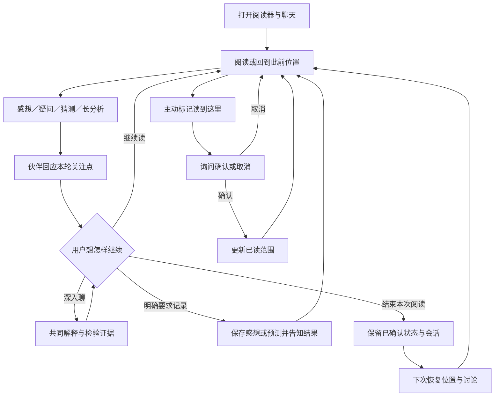

# StoryPal 产品需求文档（PRD）

> 版本：v0.1 讨论稿｜2026-10-02
> 产品负责人：用户；设计与开发协作者：Codex。
> 本文从需求和体验出发，不以已有工具反推产品。九类场景与“先回应、由用户决定是否深入”已获用户认可；下文的具体优先级、验收门槛及待开发能力为提案，不等于已确认或已交付。

## 1. 一句话定义

一个跟着你的阅读位置和想法一起前进、能帮助你理解并形成自己解读的共读伙伴。

StoryPal 既能陪用户分享读到某个瞬间的反应，也能在用户愿意深入时，一起分析人物、关系、因果、规则和伏笔。它的价值不是替用户读完，或给出唯一正确的赏析，而是让阅读更容易接续、讨论更值得继续。

## 2. 用户与使用环境

### 2.1 首版目标用户

喜欢长篇叙事、愿意讨论角色与故事，但不一定熟悉原作的读者。可能边读边说一句感想，也可能在读完一个篇章后整理长分析；会遗忘前文，存在阅读中断，并希望避免剧透。

首版服务桌面 Web：原文阅读器与聊天共处一页，先聚焦已接入的《流浪地球》。用户提供的游戏感想用于理解需求，不意味着当前已接入三款游戏，也不代表其完整剧情或演出可用。

### 2.2 典型阅读节奏

- 一个篇章可能持续 2～3 小时，实际时长随作品与用户变化，不按固定时间催总结。
- 用户在关键选择、疑惑、喜欢或不满的瞬间发言；长时间不说话也应能自然续接。
- 过程中倾向短回应，通关后或主动深入时可长讨论，但不把时长直接当作意图分类依据。
- 恢复阅读时既需要想起发生了什么，也需要想起自己当时在想什么。

## 3. 核心问题与产品价值

| 用户遇到的问题 | 需要的帮助 | 成功体验 |
| --- | --- | --- |
| 想分享一个瞬间，但得到模板式分析或敷衍 | 一个贴合内容、有自己的反应的伙伴 | 第一轮就愿意接着聊，而不是重新解释自己的意思 |
| 没理解角色选择，或忘记相关前文 | 定位卡点并补必要材料 | 可以继续读，不需要先听全书复述 |
| 时间、视角、设定交错 | 一起检验证据和可能解释 | 知道哪里明确、哪里还不能确定 |
| 有自己的判断，却缺少整理与挑战 | 有依据的新观察、反例和论证 | 保留自己的解读，也能修正推理跳步 |
| 提过猜测，后来忘了为什么这样猜 | 留住当时判断并在合适时回看 | 看见自己的认识如何变化，而不是被事后答案覆盖 |
| 中断后难以重新进入故事 | 恢复阅读位置与讨论线索 | 不剧透地接上上次的兴趣与问题 |

## 4. 产品目标与非目标

### 4.1 本阶段目标

1. 首轮抓点：理解用户想分享、求解、质疑还是深入讨论；不把每句话变成分析题。
2. 角色自然：温暖、机敏、可有不同意见，情感落在具体内容上；用户愿意与这个声音相处。
3. 有效理解：在已读证据上连接场景，贡献解释、观察或必要的纠正，而不只是检索复述。
4. 连续陪读：阅读位置、互动约定和用户自己的讨论能够逐步续接，区分已实现与目标能力。
5. 零越界：不泄露未读内容，不擅自推进进度，不把用户猜测写成作品事实。

### 4.2 首版不做

- 手机端、语音、虚拟形象、全作品导入与自动采集游戏画面。
- 替代攻略、自动给剧透答案、固定时间推送、强迫读后感或测验。
- 恋爱／占有式身份与虚构真人经历。
- 把用户认可作为唯一评价，或把检索命中率当成陪伴质量。
- 本轮直接迁移框架、上线多 Agent、决定向量索引或模型选型；这些在产品回应契约确认后再讨论。

## 5. 九类场景及回复契约

| ID | 场景与典型诉求 | 首轮应提供什么 | 用户愿意深入时 | 不应出现 |
| --- | --- | --- | --- | --- |
| S1 | 即时感受与共鸣：喜欢、难过、惊讶、吐槽 | 对具体瞬间的反应；必要时一个轻观察 | 讨论为何有效、哪里别扭 | 空泛共情、读后感课堂、每轮强制提问 |
| S2 | 发散聊天：现实经历、文学或其他作品联想 | 顺着用户话题，自然交流 | 比较与联想，标清文本之外的延伸 | 强拉回故事、凭空诊断用户 |
| S3 | 卡点与回忆：为什么这样做、前文说过什么 | 最小必要解释或可辨认候选 | 补场景与因果 | 要求精确复述、猜错场景仍继续 |
| S4 | 时间线与视角：何时发生、谁知道什么 | 拆开混淆的节点或认知状态 | 重建局部顺序与候选解释 | 顺口补全所有空缺、把叙述顺序当事件顺序 |
| S5 | 规则一致性：能力、强弱、条件与代价 | 指出疑点对应的条件 | 比较旧规则、新信息与缺口 | 无条件圆设定、只列战力排名 |
| S6 | 人物与关系：动机、成长、羁绊 | 从具体行为回应判断 | 比较愿望、选择、代价与关系变化 | 人格标签替代行为、把喜欢等同于写得好 |
| S7 | 预测与伏笔：猜测、揭示后回看 | 讨论依据与替代解释，保留悬念 | 分开核对对象、原因、原依据 | 暗示猜对、事后冒充早知道 |
| S8 | 篇章与主题：铺垫、节奏、角色展开、比较 | 抓主论点并贡献一个有效角度 | 组织论证、反例与综合评价 | 只有复述或赞同、把个人观点当标准答案 |
| S9 | 重返与更新：接续位置、旧问题和旧判断 | 短恢复；明确哪些记忆找到了 | 新证据如何改变认识 | 编造共同历史、冻结旧态度、借恢复泄露后文 |

同一句话可以同时包含多个场景。场景标签只用于需求与验收，不要求前台显示，不强制一类一个工具或一类一个 Skill。

### 5.1 首轮抓点的共同规则

- 先回应当前主诉求：直接问题直接答，分享可以一起感受，长分析可以认真讨论。
- 不先对用户进行分类，不套“你真正想要的是……”。
- 一次可只贡献一个观察，允许聊到这里就停，不强制追问和可选功能推销。
- 用户要求别分析，就停止展开；用户要求深入，不用短句或玩梗逃避。
- 需要核验的事实不能先随口认同、再补证据。语气自然与事实可靠都属于首轮质量。
- 证据不足应说明缺哪一块，允许讨论可能性，不把“不确定”作为终止交流的模板。

## 6. 关键用户旅程

### 6.1 读到某段，分享感受

用户不必报告内部单元编号。直接发言或划选原文后提问，伙伴利用已读材料与近邻对话理解指代。没有场景依据时可以轻问，不凭空编造。回应后不自动保存偏好或预测。

### 6.2 问题发展成讨论

首轮解决最主要的点。后续允许用户反驳、补充和改变话题；伙伴能够保留分歧，不必把每次对话收敛成结论。复杂理解可使用局部时间线或关系比较，但用户没有要求时不强制输出长图表。

### 6.3 用户自己的推理轨迹

用户明确要求记录时保存判断及理由；不要只留最终答案。揭示后的回看可以发现对象正确而原因错误。自动触发与长程讨论状态目前属于待开发设计，不能承诺今天已经可以。

### 6.4 阅读位置与模糊印象

浏览位置与已读范围分开。段尾标记是用户报告，不直接算确认；模糊描述定位只能先给候选，不能推定已读。候选预览也必须不泄露未经允许的后续内容；具体交互待设计。

## 7. 需求清单与当前状态

P0/P1 为本稿建议优先级。状态“已有”仅表示代码／原型存在，不等于真人体验已通过。PRD 不替代代码审计与结果记录。

| ID | 需求 | 优先级 | 当前状态 | 产品验收条件 |
| --- | --- | --- | --- | --- |
| F01 | 桌面阅读器与聊天共生，划选提问、本地续读 | P0 | 已有原型，实际操作待本轮核验 | 能在同一页读与聊，选文可辨认，不因滚动推进已读 |
| F02 | 逐段报告、确认／取消与恢复进度 | P0 | 已有原型，真实对话待核验 | 只确认已读位置；取消不写，刷新／重开可恢复 |
| F03 | 首轮抓点与稳定自然声音 | P0 | SOUL.md v0.2 已加载，模型体验待验收 | 回应本轮主诉求，不空泛附和或机械分析 |
| F04 | 已读范围的事实、卡点与人物讨论 | P0 | 检索与结构化导航已有，综合质量未验收 | 用有效证据回应，能分清事实、解释和缺口 |
| F05 | 时间线、规则、伏笔与篇章综合理解 | P0 | 基础材料访问已有，专门方法待设计 | 能比较解释和反例，不靠后文或用户迎合补答案 |
| F06 | 明确记录与回看感想、问题、预测 | P0 | 手账保存与读取已有，编辑／删除待做 | 写入成功才称已记录；作品和用户隔离 |
| F07 | 用户反馈口吻与交互约定可续接、可忘记 | P0 | Note 显式写忘与注入已有；自动维护部分试作 | 明确约定能找回，临时情绪不固化成人格 |
| F08 | 恢复阅读与此前关注点 | P0 | 进度、会话与显式手账支撑已有，完整体验待补 | 找到的才说记得，不把检索摘要当共同经历 |
| F09 | 从非逐字的印象辅助定位 | P1 | 语义检索可提供候选，定位确认链未接通 | 不要求完美复述；不唯一时询问，拒绝时不推进 |
| F10 | 预测在进度变化后适时回看 | P1 | 待设计与实现 | 只看新开放范围；可拒绝，不阻塞普通聊天 |
| F11 | 可回跳的证据、已确认位置高亮与便捷手账入口 | P1 | 待设计与实现 | 验证依据与读聊切换更省力，原文不公开外泄 |
| F12 | 跨会话讨论经历与认识变化 | P1 | 长程情景记忆目标待实现；旧 HistoryMemory 不是最终方案 | 可溯源恢复真实经历，不凭空创建记忆 |
| F13 | 理解侧＋表达侧对比 | 实验 | 已记录备选，未实现／未确认上线 | 有体验净收益且不改事实确定性；否则保留单 Agent |

## 8. 用户侧记忆的产品语义

本节只约定用户能理解的含义，不先选存储与检索方案。

- 阅读进度：用户确认读到哪里，是证据可见范围的依据。
- 互动约定：怎样一起聊、明确的偏好和纠正；不是故事事实。
- 阅读手账：用户愿意留下的感想、问题、猜测及理由，允许后来修正。
- 共同经历：曾经怎样讨论、认识为何发生变化；未来恢复时可溯源。
- 作品资料：原文和处理后的剧情材料，不能被用户猜测或聊天情绪改写。

普通对话仍由现有会话历史保存；“不记手账”不是无痕模式，也不表示不留日志。涉及长期记忆的写入与自动维护，必须单独说明当前能力和准入，不能以陪伴为由默默扩张收集范围。

## 9. 体验、可靠性与安全要求

1. 不剧透：正文、引用、检索候选、人物解释和恢复内容都受已确认范围约束；“你猜得很接近”也可能泄露信息。
2. 不越权写入：阅读进度确认、手账、互动约定分别处理；回复“已经保存”必须与真实结果一致。
3. 来源清楚：原文事实、角色说法、用户判断、AI解释不能混为一谈；需要时能查回依据，日常聊天不强制堆引用。
4. 不打断：不把每次感想转为维护、询问或记录，不固定周期要求复盘。
5. 能纠偏：用户指出误解时先修正当前理解，不用长道歉取代回应。
6. 可退化：工具失败时不编答案；自然说明能继续讨论什么、缺什么依据。
7. 等待可感知：记录首个有效回应和完整回复的实际等待感；本稿不宣称既有延迟达到某个数值，不先定未经测量的 SLA。
8. 内容边界：小说原文、用户截图、配置与个人会话不随公开仓库提交；PRD 用概括与虚构例，不放私人原文附件。

## 10. 验收计划

### A. 当前声音小样

按 [口吻快速验收](../operations/COMPANION_VOICE_ACCEPTANCE.md) 进行：一个虚构故事、四个主输入和一次可选追问，约 5～8 分钟。不改变真实阅读进度。重点看首句、自然度、有效贡献与事实保持。

### B. 真实陪读

用户只选择真正读过的一小段：先分享反应，再问一个动机／因果问题，必要时深入。核验是否抓中关切、是否用对依据、是否让自己愿意继续读。真实剧情理解不能由虚构小样或检索命中率代替。

### C. 连续性与写入

另开小批次核验实际段尾确认／取消、显式手账保存找回、明确互动约定与忘记。不要在声音小样里顺手修改真实状态，不为了测试将未读内容确认为已读。

### 判定口径（提案）

- 每例记录“首句抓点／声音自然／有效贡献／事实边界”，不用唯一标准回复。
- 未读泄露、虚构证据、未确认推进、虚假保存与串用户数据为硬失败。
- 口吻暂定四个主样至少三个愿意自然接话；不认可时记录具体句子与期望方向，不用自动评分抵消真人反馈。
- 条件没覆盖或没有执行就标待核验；服务 200、单测通过只属于各自层级。
- 产品级通过还需要真实读聊与连续性证据；本稿不宣布整体产品已验收。

## 11. 后续设计顺序与用户参与

1. 讨论本 PRD：用户判断目标、九类场景与优先级；先确认声音的关系距离，不默认恋爱或动作扮演。
2. 为九类场景各选少量输入与回应：明确首句的价值，允许多个好答案；优先人物关系、预测与因果，不一次完成所有样例。
3. 再设计 Skill：讨论哪些方法可复用，哪些属于基本人格；不是把场景标题变成固定话术。
4. 再设计模块：阅读状态、证据材料、讨论状态、记忆与表达分工；双脑只是方案之一。
5. 最后确定接口与实现：依据已确认体验做最小增量，并用受影响回归及小规模真实行为验收。

需用户介入的决策：声音是否合口味、先重点做哪些场景、如何处理主动回看／记录、是否值得实验双脑。数据事实核验与程序验收由开发侧推进，不能要求用户逐条检查内部编号。

## 12. 文档关系与版本记录

- 本 PRD：需求、目标体验、范围和产品验收，是产品讨论入口。
- [场景与声音](COMPANION_SCENARIOS_AND_VOICE.md)：口吻细节、研究依据及双脑备选。
- [初次阅读体验](CHATBOT_FIRST_READING_EXPERIENCE.md)：历史原型设计，旧状态以最新 PRD 与进度为准。
- [RAG/Memory 规格](../architecture/STORYPAL_RAG_MEMORY_SPEC.md)：技术契约；本稿不使未实现能力自动成为事实。
- [开发进度](../operations/CHATBOT_DEVELOPMENT_PROGRESS.md)、[结果记录](../../result.md)：分别记录执行状态与已实跑结果。

v0.1：以用户认可的九类需求为基础建立整体产品稿；提出首轮抓点、独立自然声音、综合理解与连续陪读验收。尚待用户评审，不新增工程完成承诺。
