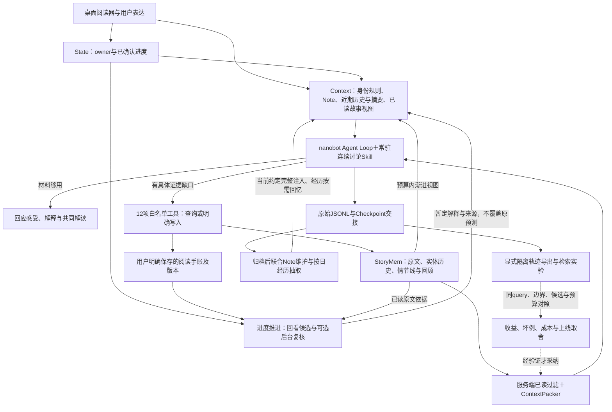

# StoryPal：从阅读需求到Agent与检索实验的完整叙述

更新：2026-10-04。本文件是项目讲解主线，不是把所有TODO包装为完成；数据引用独立结果报告，历史文档与测试数量不累加。

## 1. 为什么做：用户缺的不是一段剧情摘要

产品定义：一个跟着你的阅读位置和想法一起前进、能帮助你理解并形成自己解读的共读伙伴。

需求来自长篇阅读与篇章讨论：喜欢一个角色却质疑铺垫，记不清前文，想重建局部因果，预测后来是否仍成立，隔天想接续自己的分析。用户可能只是说一句感受，不需要立刻检索。首版围绕《流浪地球》桌面Web，游戏感想是需求材料，不意味着已接入游戏剧情。

可用的项目概述：面向长篇叙事阅读的记忆断裂、事实核验与剧透控制，设计剧情陪伴Agent；以阅读进度State驱动ReAct式Agentic RAG，按需编排Memory、结构化Story Retrieval与Tool Calling，并通过Policy约束执行、以Provenance支撑可核验的已读范围问答。

这里ReAct式指“模型选择工具→观察结果→继续回答”的运行方式，底层用provider结构化tool_calls，不手工解析公开思维链。项目目标是辅助理解，不给唯一文学答案。

## 2. 自上而下的系统

图是已接线模块关系；后台复核默认关闭，已验证一个合成场景的真实复核与承接、复杂语义待验收，实验收益不自动进入生产。Policy和Provenance不是万能组件：owner／已确认进度／模型白名单由代码约束；写入意图及文学解释仍需规则与验收；调用JSONL、单元引用、阅读边界、时间与来源摘要用于追溯，不保证所有解释都正确。

## 3. 一次讨论怎样推进

1. 用户从阅读器带片段或自然发问，已确认位置提供安全边界，选中与滚动不自动推进已读。
2. 组装当前片段、近期讨论／中文摘要、有效Note和预算内已读故事视图，不把整书或全部历史塞进去。
3. Skill指导先抓关注点。足够就直接聊；需要精确措辞查原文，变化过程查结构历史，再凭真实unit_id核验。角色动机说得通，不等于作品铺垫自然。
4. 工具在服务端绑定owner和阅读边界，结果经预算装包；失败／空结果不是“作品没有”，主Agent继续解释或保留未知。迭代最多6轮，不无限重试。
5. 用户明确要求才记手账或Note。进度propose后下一回合confirm，模糊位置先询问。查证不会擅自推进阅读。
6. 历史压缩后保留观点归属、澄清、依据与未解问题；下一请求低频抽取日经历，跨会话需要时语义回忆。进度推进可另复核旧预测，保存暂定依据，不重写过去。

## 4. 为什么拆成这些记忆层

| 层 | 解决的问题 | 当前实现／限制 |
| --- | --- | --- |
| 原始历史＋Checkpoint | 当前会话工作交接；压缩后仍能接续讨论 | JSONL保留，中文摘要模板保留观点与未知；不是完全无损 |
| Note.md | 当前非剧情约定、偏好和纠正 | 有效Markdown完整注入，临时按会话，观察归档复核；长Note与Dream消费待做 |
| 阅读手账 | 用户主动留住感受、问题、预测 | 每owner JSON，修订独立锚点，较早范围投影原版本；不自动判对错 |
| 按日互动经历 | 我们当时怎样讨论、理解为何变化 | Markdown＋可重建BGE-M3/LanceDB索引；原生闲置压缩→联合维护→新会话主动回忆已过一条真实合成小样，向量替身；另有真实BGE小样，阈值未标定 |
| StoryMem | 作品本身发生了什么 | 协作方渐进单元与结构历史；与用户观点隔离，抽取可能有误 |
| 复核结果 | 新已读依据怎样影响旧观点 | 独立暂定结果＋quote／版本／边界，默认关闭；两次真实Luna请求跑通一条合成复核→主Agent承接，复杂语义未验证 |

工具原始流水留轨迹；只有影响理解的查证要点／未知才进入日经历。不是所有Observation都变记忆。`MEMORY.md`仍暂缓，不为凑技术栈增加Redis或复杂时间冲突模型。

## 5. 自己做了什么、复用了什么

- nanobot提供Loop、provider、结构化调用、会话／压缩、WebUI；不把这些说成自研框架。
- StoryPal负责场景契约、角色／Skill、阅读器补丁、owner进度与确认、服务端边界、上下文投影与临时块回放、用户记忆分层、联合维护与回忆、手账版本／复核工作流、隔离trace导出及实验应用取舍。
- StoryMem由协作方提供离线抽取、原文与结构历史、FTS／LanceDB适配；主项目维护连接契约及授权范围内的协作接口扩充。没有把渐进累积实体／事件误称为完整知识图谱，也没有成熟父子索引。
- 固定工具白名单和业务权限是当前Policy；关闭命令／文件工具，不声称已实现通用沙箱。Workflow是确定性业务顺序，不为一条队列迁移LangGraph；Skill是主Agent的方法说明，不替代服务端权限检查。

## 6. 检索经历怎样讲成一条故事

业务失败：跨阶段解释不能只命中最近一段。基线：固定同作品、阅读边界和必要证据集合；分层看候选召回→排序→实际装包→最终理解，而不是只看任一命中。

1. 核查稀疏实现发现现有FTS路线23/29次扫描回退；明确区分纯FTS、jieba与扫描，避免错把库名当算法。
2. 原话Dense实际装包必要集合26/27；真正jieba＋Dense等权／2:1 RRF仍26/27，没有上线覆盖收益。
3. 朴素分句／首位保留由26/27降到25/27；省略主体／阶段及融合排序可能共同影响，不把相关现象当单因素因果。
4. 6场景授权批次采5条实际首query＋1次无工具暂停，正式非空既有金标仅3例；R25早段进入Top3是局部观察，query与可见语境同时变化，不宣称整体自动改写胜出。
5. 缓存词项重排MRR最高0.938，对比Dense0.895，但装包仍26/27、R25有Top5损失。首命中升位不等于互补证据齐全，故保持生产默认。
6. 2026-10-04扩15任务／30问（其中14故事任务28问，候选标签待独立复核）：Dense装包16/28，固定RRF18/28但新增3个损失、任务双问完整仍5/14；确定性结构导航5/28，不能替代Dense。预选5任务同池Qwen重排6/10→9/10，但CPU每问评分中位15.92s，先扩大验证不直接上线。独立报告见[CPU对照](../research/retrieval/CPU_ROUTES_2026_10_04.md)，不是盲测或最终回答质量。108单元不优先做ANN性能工程。

现有29例是开发探索集、只有5个多证据问题；问法改写不算独立任务，不能称跨作品泛化。新包15任务／30问已运行离线诊断，但正式独立新金标为0；证据不足不凑数量，也不把模型建议直接定金标。最新进展以[检索PLAN](../research/retrieval/PLAN.md)为准。

## 7. 当前能证明什么、还不能证明什么

能证明：业务存储与边界、工具／Skill／上下文接线可程序复跑；Note、日经历、手账分开；一条原生闲置压缩→联合维护→空白会话主动回忆的真实合成链，另有同会话澄清、情绪暂停、工具失败、手账对照和够用不查的小样；一条旧预测被异步复核并在新会话承接、原观点不变；已做带负结果及CPU专用重排的检索对照。

不能证明：陪读普遍更好、自动摘要无损、长程阈值已校准、模型永不隐性剧透、自然进度推进至复杂预测复核的完整流程通过、reranker或第二Embedding胜出。测试数量不是准确率；先前回归有重叠，不累加。

下一关键验证：自然WebUI压缩调度、真实已读StoryMem视图与结构历史如何参与用户讨论、多经历竞争与独立任务的最终理解。原生闲置压缩入口已显式调用验收，不把它说成自然token阈值完整验收；15次六场景和前次两次复核详见根result，不外推至复杂伏笔。用户评价首回复抓点、观点承接与理解增量；开发侧验证来源、权限和预算。

## 8. 讲解与证据入口

可按“读者困境→为什么单次RAG不够→State限定证据→Skill驱动工具→记忆维持理解→Workflow处理变化→实验发现瓶颈→证据与成本决定取舍”讲解。不要先从模型和数据库列表开始。

- 需求：[PRD](STORYPAL_PRD.md)。
- 应用当前状态：[开发进度](../operations/CHATBOT_DEVELOPMENT_PROGRESS.md)与[TODO](../architecture/STORYPAL_REMAINING_WORK.md)。
- 记忆：[日经历](../architecture/STORYPAL_EPISODIC_MEMORY.md)、[Note](../architecture/STORYPAL_NOTE_MAINTENANCE.md)、[手账](../architecture/STORYPAL_READING_JOURNAL.md)、[复核](../architecture/STORYPAL_JOURNAL_RECHECK.md)。
- 数据：[根result](../../result.md)、[检索RESULT](../research/retrieval/RESULT.md)、[算法EXPERIENCE](../research/retrieval/EXPERIENCE.md)。
- 应用判断：[采纳记录](../architecture/RETRIEVAL_FINDINGS_ADOPTION.md)；不把实验配置自动写进生产。
